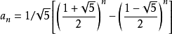
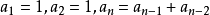

# 斐波那契数列
### 斐波那契数列是一组数列，从 0 和 1 开始，之后（第3项开始）的每一项都等于前两项之和。
例如：斐波那契数列的前 10 个数是：
> 0, 1, 1, 2, 3, 5, 8, 13, 21, 34

在数学上，用递归的方法定义斐波纳契数列如下：
> F(0)=0
F(1)=1
F(n)=F(n-1)+F(n-2)（n>=2，n∈N*）

也可用通项公式：



(如上，又称为“比内公式”，是用无理数表示有理数的一个范例)

注：此时

## 思路
1.用递归方法能求得任意一项的斐波那契数；
2.从第一项开始输出，直到指定项结束。

## 代码片段
`fibo_num(item)` 函数是利用递归的方式求第 item 项的的斐波那契数。要输出某项斐波那契数，调用该函数即可：
```
def fibo_num(item):
    if item > 2:
        return fibo_num(item-1) + fibo_num(item-2)
    elif item == 2:
        return 1
    elif item == 1:
        return 0
```
而 `each_item(items)` 函数里面定义了从第 1 项开始输出之后的每一项，直到第 items 项结束。
```
def each_item(items):
    for item in range(1,items+1):
        print("%d, " % fibo_num(item), end="")
    print("……\n")
```
在用户输入要输出多少项斐波那契数之后，应该判断用户输入值是否符合程序要求的正整数（多少项），如果不符合要求就给出相应的提示。
所以用户不能输入比 1 小的数，也不能输入小数（输出 5.1 项是啥意思？）。
判断是否比 1 小比较简单 `items < 1` ，那判断是不是小数呢？我注意到 `type(5.1)` 返回的是 `float`，因此可以用 `type(items) == float`。
```
items = input("您要输出斐波那契数列的多少项？（正整数）：")
if items < 1:
        print("不能输入小于1的数，请您重新输入一个正整数\n")
elif type(items) == float:
        print("不能输入小数，请您重新输入一个正整数\n")
```
可是万万没想到程序报错。
```
F:\Python>python Fibonacci_sequence.py
您要输出斐波那契数列的多少项？（正整数）：10
Traceback (most recent call last):
  File "Fibonacci_sequence.py", line 18, in <module>
    if items < 1:
TypeError: '<' not supported between instances of 'str' and 'int'

F:\Python>
```
上面提示的意思是 **str** 不能与 **int** 作比较，也就是说用户以为输入的是数字，但其实是字符串。
如果把输入的转换为 **int** 类型不就可以比较了吗？
```
items = int(input("您要输出斐波那契数列的多少项？（正整数）："))
if items < 1:
        print("不能输入小于1的数，请您重新输入一个正整数\n")
elif type(items) == float:
        print("不能输入小数，请您重新输入一个正整数\n")
```
可是再观察一下会发现 `type(items) == float` 永远不会成立！因为 items 被 `int()` 转化为整数。
如果把用户输入的字符串用 `float()` 转成浮点型，`type(items) == float` 又永远都成立。
后来我又注意到 `int(5.0)` 返回 `5`，而 `int(5.1)` 也返回 `5`，这样就可以根据 `int()` 转换前后的值是否相等来判断是小数还是整数。
```
>>> int(5.0) == 5
True
>>> int(5.1) == 5.1
False
```
返回 `True` 表示用户输入的是整数（当然也可能用户本来输入 `5.0`，这种情况也当作整数吧），
返回 `False` 表示用户输入的是小数。

为了方便用户可以不断输入，让程序不断循环，可以把修改后的代码放进 ``while True:``，直到用户按 `Ctrl + C` 快捷键才结束。代码如下：
```
try:
    while True:
        items = input("您要输出斐波那契数列的多少项？（正整数）：")
        if items < 1:
            print("不能输入小于1的数，请您重新输入一个正整数\n")
        elif type(items) == float:
            print("不能输入小数，请您重新输入一个正整数\n")
        else:
            each_item(items)
except KeyboardInterrupt:
    print('\n结束！')
```
## Python Code
```
def fibo_num(item):
    if item > 2:
        return fibo_num(item-1) + fibo_num(item-2)
    elif item == 2:
        return 1
    elif item == 1:
        return 0

def each_item(items):
    for item in range(1,items+1):
        print("%d, " % fibo_num(item), end="")
    print("……\n")

if __name__ == "__main__":
    try:
        while True:
            items_float=float(input("您要输出斐波那契数列的多少项？（正整数）："))
            items_int = int(items_float)
            if items_int < 1:
                print("不能输入小于1的数，请您重新输入一个正整数\n")
            elif items_int != items_float:
                print("不能输入小数，请您重新输入一个正整数\n")
            else:
                each_item(items_int)
    except KeyboardInterrupt:
        print('\n结束！')
```
执行结果如下：
```
F:\Python>python Fibonacci_sequence.py
您要输出斐波那契数列的多少项？（正整数）：10
0, 1, 1, 2, 3, 5, 8, 13, 21, 34, ……

您要输出斐波那契数列的多少项？（正整数）：2
0, 1, ……

您要输出斐波那契数列的多少项？（正整数）：1
0, ……

您要输出斐波那契数列的多少项？（正整数）：0
不能输入小于1的数，请您重新输入一个正整数

您要输出斐波那契数列的多少项？（正整数）：-1
不能输入小于1的数，请您重新输入一个正整数

您要输出斐波那契数列的多少项？（正整数）：5.1
不能输入小数，请您重新输入一个正整数

您要输出斐波那契数列的多少项？（正整数）：
结束！

F:\Python>
```
