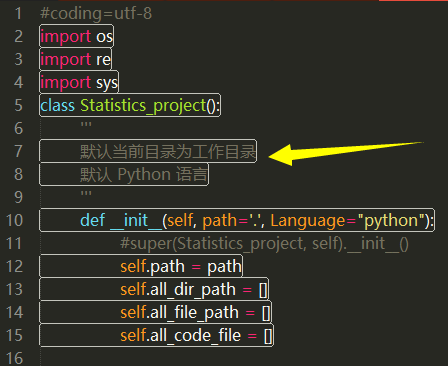
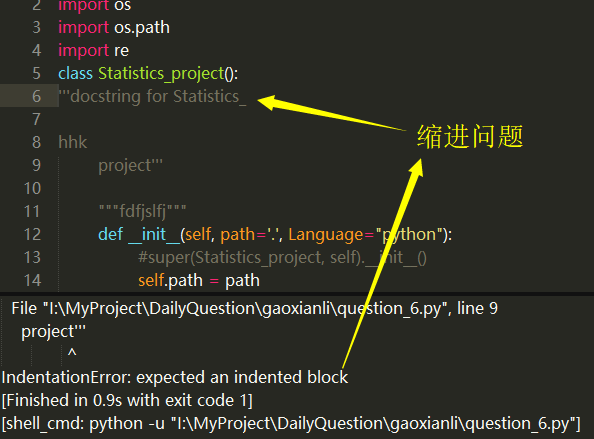
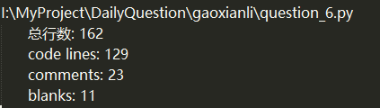
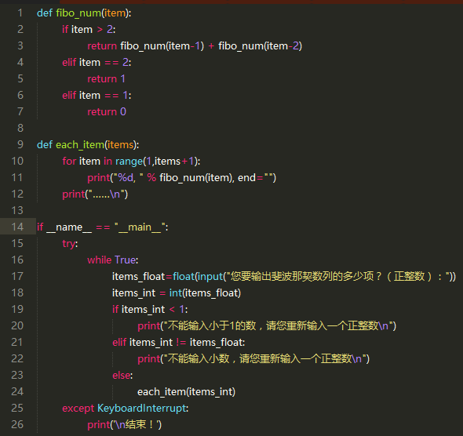
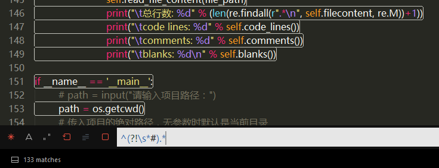
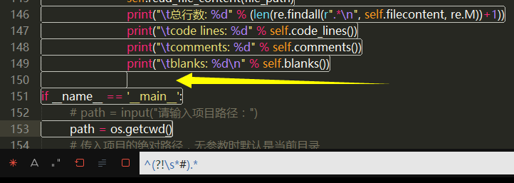
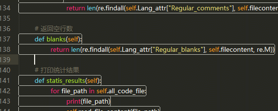

### 设计用于统计代码文件中代码信息的程序，如：文件个数、代码行数、注释行数、空行行数
尽量设计灵活点，可通过命令行输入不同参数来统计不同语言的项目，如执行：

`python counter.py --path python`

--path 用于指定项目路径
输出：
```python
files:10
code_lines:200
comments:100
blanks:20
```

看到这道题时，我就有了大概的框架。（本文除了文末的“完整源代码”部分，其它代码都是用于梳理思路的伪代码）
一个项目文件夹可以包含多级目录，每个目录又可以有不同文件，我可以先遍历项目文件夹下的所有目录，然后找到文件并放进一个列表中，然后根据不同语言它对应不同后缀的代码文件进一步筛选放进另一个列表中。当然这些列表中保存的都是文件的绝对路径，方便直接读取文件里面的内容。因为要分析代码里面哪些是代码行、注释行、空行，所以我首先想到的是用正则来找。大体框架如下：
```python
class Statistics_project():
	# 遍历所有目录和文件，把目录和文件用两个列表区分开
	def all_dir_file():

	# 统计文件数 files，返回整数。保存文件路径的列表的长度就是文件的个数
	def files():

	# 筛选出某语言的代码文件，比如找出 python 语言的代码文件是以 .py 为结尾后缀的
	def code_files():

	# 读取文件内容，遍历读取每一个代码文件里面的内容
	def read_file_content():

	# 分析并返回代码行数
	def code_lines():

	# 分析并返回注释数
	def comments():

	# 分析并返回空行数
	def blanks():

	# 打印统计结果
	def statis_results():

```
遍历所有目录和文件时我使用了 **os** 模块的 **walk()** 方法，它可指定要遍历的路径作为参数，返回由 所有绝对路径、所有目录名列表、文件列表 组成的三个元素。
如下指定了一个绝对路径：`"I:\MyProject\DailyQuestion\gaoxianli"`，然后通过 `for root, dirs, files in dir_lists:` 迭代打印了这三个元素，如下
```
>>> dir_lists = os.walk("I:\MyProject\DailyQuestion\gaoxianli")
>>> for root, dirs, files in dir_lists:
...     print("root: %s " % root)
...     print("dirs: %s " % dirs)
...     print("files: %s \n" % files)
...
root: I:\MyProject\DailyQuestion\gaoxianli
dirs: ['images']
files: ['import_this.txt', 'python.py', 'question_1.md', 'question_2.md', 'question_2.py', 'question_3.md', 'question_3.py', 'question_4.md', 'question_4.py', 'question_5.md', 'question_5.py', 'question_6.md', 'question_6.py']

root: I:\MyProject\DailyQuestion\gaoxianli\images
dirs: []
files: ['Domain_name_rules.png', 'General_formula1.png', 'General_formula2.png', 'No_distinction_between_agreements.png', 'path_and_file.png', 'relatively_path.png', 'Simplified_Chinese_domain_name_suffix.png', 'Transfer_Protocol.png', 'WSS_Transfer_Protocol.png', ' 多行注释缩进问题.png']
```
将文件的绝对路径添加到文件路径列表 **all\_file\_path** 里，如下面这段代码：
```python
all_file_path = []
dir_lists = os.walk(path)
for root, dirs, files in dir_lists:
      for f in files:
		# 将文件所在的路径与文件名拼接成绝对路径
		all_file_path.append(os.path.join(root, f))
```
### 统计文件的个数
文件个数等于文件列表 **all\_file\_path** 的长度：
```python
len(all_file_path)
```

### 筛选代码文件
遍历文件列表，如果文件后缀是以 **filetype** 结尾的就放进代码文件列表 **all\_code\_file**
一种语言可能有两种格式的文件后缀，如 **HTML** 文件可以是以 **.html** 或 **htm** 结尾的。
为了方便迭代操作，这里文件格式是以列表形式存在，其它语言的也要保持这种数据结构，不然在迭代代码文件格式时，可能会将格式字符串分解成一个个字符，导致意想不到的 bug 出现
```python
all_code_file = []
Lang_attr = {"filetype" : ["html", "htm"]}
for f in all_file_path:
	for filetype in Lang_attr["filetype"]:
		# 文件格式符合就文件路径添加进代码文件列表
		if f.endswith(filetype):
			all_code_file.append(f)
```

### 读取文件内容
只需提供文件的绝对路径即可读取文件里的内容
读取文件可能出现解码失败的情况，因为有些文件不是以 **UTF-8** 编码格式保存，需要做异常处理
注意保存文件内容到变量 **filecontent** 前要清空内容，计算文件总行数的变量 **file\_line\_count** 也要归零。
```python
filecontent, file_line_count = "", 0
try:
	with open(file_path, encoding="utf8") as f:
		for line in f:
			file_line_count += 1
			filecontent += line
except UnicodeDecodeError as e:
	print("该文件解码时出错，请手动保存该文件的编码格式为UTF-8： %s \n" % e)
```
OK，接下来就是要分析代码文件里面的内容了。
最近看到一句话：**算法是区分程序员与码农的标准，感觉现在这个位置就是这个标准的分界线了**。

首先，为了避免正则表达式由于转义字符导致无法匹配问题，需要在正则表达式字符串前加 **r** 或 **R** 表示原始字符串，如：`r"^\s*(\w)"`
要匹配和捕获到所有字符串，这里使用 **re** 模块的 **findall()** 方法，它可以返回所有匹配到的字符串组成的列表，不过需要注意的是，如果只给 **findall()** 传入两个参数（正则表达式和文件内容），`re.findall(pattern, filecontent)` 是无法正常匹配到需要的字符串，因为变量 **filecontent** 保存的是**一行**转义的文件内容，例如下面这样：
```python
>>> with open("question_2.py", encoding="utf8") as f:
...     filecontent = f.read()
...
>>> filecontent
'import random\nprint("系统已生成了一个1~100之间的整数，请输入系统生成的数字，不过您只有 五次机会")\nprint("游戏开始:\\n")\nnum = random.randint(1,100)\ncount = 5\n\nwhile count:\n    usernum = int(input("第%d次猜的数字是：" % (6 - count)))\n    if usernum == num:\n        print("恭喜您猜中了，答案就是",num)\n        break\n    elif usernum < num:\n        if count != 1:#如果已经是最后一次机会就不用输出\n            print("真不走运，您猜小了，请猜大点的吧:\\n")\n    else:\n        if count != 1:\n            print("真不走运，您 猜大了，请猜小点的吧:\\n")\n    count -= 1\n\nif count == 0:\n    print(\'太倒霉了，您用 光了五次机会，而且还没猜中！\')\nelif count == 1:\n    print("太危险了，刚好最后一次机会 被您猜中了，不过也挺厉害的了！")\nelse:\n    print(\'你牛B，五次机会还没用完就猜中了！\')\n    \nprint("游戏结束")\n'
```
可我希望是有好的缩进便于阅读和便于用正则匹配的多行模式，如下代码是上面一行正常的多行格式：
```python
import random
print("系统已生成了一个1~100之间的整数，请输入系统生成的数字，不过您只有五次机会")
print("游戏开始:\n")
num = random.randint(1,100)
count = 5

while count:
	usernum = int(input("第%d次猜的数字是：" % (6 - count)))
	if usernum == num:
		print("恭喜您猜中了，答案就是",num)
		break
	elif usernum < num:
		if count != 1:#如果已经是最后一次机会就不用输出
			print("真不走运，您猜小了，请猜大点的吧:\n")
	else:
		if count != 1:
			print("真不走运，您猜大了，请猜小点的吧:\n")
	count -= 1

if count == 0:
	print('太倒霉了，您用光了五次机会，而且还没猜中！')
elif count == 1:
	print("太危险了，刚好最后一次机会被您猜中了，不过也挺厉害的了！")
else:
	print('你牛B，五次机会还没用完就猜中了！')

print("游戏结束")
```
所以需要利用 **findall()** 提供的第三个可选参数 **re.M**，将文件内容由一行变成**多行模式匹配**（像上面这种有换行格式）：`re.findall(pattern, filecontent, re.M)`
### 返回代码行数

代码行数的正则为：`^\s*(\w)`，翻译成人话就是：所有以字母、数字、下划线开头（中间可以有空白字符）的行。
缺点是有些代码不一定以 \w 开头，如下面以单引号开头的 key：
```python
self.Language={
	'python': {
            'filetype': ['.py'],
            # 注释涉及到三种字符串 #、"""、'''
            # 单行注释正则
            'Single_line_comment': r"^\s*#.*",
            # 多行注释正则（必须成对出现 """ 或 '''）
            'Multi_line_comment':r"^\s*([\'\"]{3})[\W\w]*?\1",
            # 空行正则（如果 ^\s* 后面没有问号?，那么它将连续的多行当作一行匹配）
            'Regular_blanks': r"^\s*?\n"
      }
}
```
像这样就不能准确匹配所有，不能用


代码行数的正则：`^(?!\s*#).*`，翻译成人话就是：匹配除了以井号 **#** 开头的其它行。缺点是会匹配到多行注释，如下多行注释：
```python
"""
默认当前目录为工作目录
默认 Python 语言
"""
```
如果再排除以三重引号开头的 **'''** 或 **"""** 的行：
`
^(?!\s*#)(?!^\s*([\'\"]{3})[\W\w]*?\1).*
`

它又会匹配到注释里面的多行内容（`(?!^\s*([\'\"]{3})[\W\w]*?\1)` 是用来匹配多行注释的），这样更麻烦。



所以，我想如果要用 `^(?!\s*#).*` 这个正则表达式，可以先统计注释行数，再把匹配到的多行注释从变量 **filecontent** 中删除，避免多行注释的干扰导致统计不准确。可是打算这样做的时候，失败了。因为不能有效删掉（应该是哪写的不对）
然后我就寻找其它方法，发现其实不需要把它删掉，只需减掉多行注释所占的行数即可。
```python
def code_lines():
      m = re.search(r"^\s*(['\"]{3})[\S\s]*?(?(1)\1)", filecontent, re.M)
      if m:
      	#当发现有多行数注释时，才减去多行注释所占的行数，否则不减
      	return len(re.findall(r'^(?!\s*#).*', filecontent, re.M)) - len(re.findall(r"^[\s\S]*?", m.group(), re.M))
      else:
      	return len(re.findall(r'^(?!\s*#).*', filecontent, re.M))
```
### 统计注释的行数
注释主要有两种（单行、多行注释）：
写在井号 **#** 后面的那一行为**单行注释**，如：
```python
# 本行为单行注释
```
写在一对三重引号 **""" """** （或 **''' '''**）之间的为**多行注释**，如：
```python
"""
这里是多行注释，
多行注释可以换行，
多行注释的每一行开头无需再添加井号 # 作为注释符
"""
```

根据单行注释的特点：不管单行注释是独占一行，还是位于语句后面，写在井号 **#** 后面的那一行为**单行注释**
单行注释正则：`#.*` 
经过测试，这种匹配模式会把语句中包含井号 **#** 的字符串也列为注释（虽然这种情况少见，但还是存在的），如下面 **search()** 方法的第一个参数里包含有井号 **#** 字符：
```python
# 分段
m = re.search(r"((?<=\#)([\w\-\/\.]*))?$", self.url_str)
```
上面的井号 # 是以正则表达式字符串的形式存在的，那么它后面就会有个引号作为字符串的结尾，所以我就想只要井号 # 后面不存在引号就是注释，存在引号就是语句里的字符串。然后把单行注释的正则改成了：`#(?!.*('|\")).*	`
翻译成人话就是：当井号 # 后面不出现引号才匹配
经过测试，这种正则表达式会把注释中包含有引号（**'** 或 **"**）的也当作语句来处理了，下面就是该匹配却不匹配的注释：
```python
# print("代码文件一共有：%d 行" % f)
```
这种注释经常能看到，可用于调试，所以这种正则写得也不合理，不能用。
经过长时间寻找解决方法，但还是没写出比较完美的正则表达式。只能暂时放弃匹配单行注释位于语句后面的情况，只匹配独占一行的单行注释正则：`^\s*#.*`
翻译成人话就是：以井号 # 开头的那一行，井号前面可以N个空白字符

根据多行注释的特点：以三重引号（**"""** 或 **'''**）开头且结尾的为**多行注释**，开头的三重引号前面不得存在等号 =
多行注释正则：`(?<!\=\s)([\'\"]{3})[\w\s]*?\1`
解释下：`[\'\"]{3}` 匹配 """ 或 '''，`(?<!\=\s)` 表示三重引号前面不得有等号，等号后有一个空格，`[\w\s]*?` 为尽可能短的任意字符，'\1' 为前面匹配到哪个三重引号就是哪个
但还是不够完美，主要是等号与三重引号之间的空格不好处理：filecontent = """string"""

经过不断测试，我注意到虽然多行注释里面的内容不会被计算机执行，但**多行注释符前面那个三重引号（''' 或 """）的位置还是要按照正确的缩进书写**，不然会报错：**IndentationError: unexpected indent** 或 **IndentationError: expected an indented block**（多行注释里面的内容就可以随意书写，单行注释符对缩进没有要求）

所以，**多行注释开头的三重引号前面只能存在空白字符**，根据这个特点又修改了正则表达式：`^\s*([\'\"]{3})[\W\w]*?\1`
```python
# 返回注释数，不考虑单行注释位于代码语句后面的情况
def comments():
	m = re.search(r"^\s*(['\"]{3})[\S\s]*?(?(1)\1)", filecontent, re.M)
	if m:
		# 当发现有多行数注释时，才加上多行注释所占的行数，否则不加
		return len(re.findall(r"^\s*([\'\"]{3})[\W\w]*?\1|^\s*#.*", filecontent, re.M)) + len(re.findall(r"^[\s\S]*?", m.group(), re.M)) - 1
	else:
		return len(re.findall(r"^\s*([\'\"]{3})[\W\w]*?\1|^\s*#.*", filecontent, re.M))
```
### 返回空行行数
```python
def blanks():
	return len(re.findall(Lang_attr["Regular_blanks"], filecontent, re.M))
```



我算了以下空行行数和注释行数，统计没错，似乎可以收尾了。没错，可是问题又出现了，仔细一算，**129+23+11>162**，怎么可能大于总行数呢？检查也没发现有单行注释位于代码语句后面的情况（我也没写这样的正则去匹配它）。
经过反复检查……
下图是第4次题目的代码文件的统计结果


下图是第4次题目源代码



可以发现空行确实是2行，没有注释，总行数也是26行没错，代码行数居然也是26行。所以问题出于代码行数的统计上，它把空行也匹配上了。
所以匹配代码行数的正则表达式 `^(?!\s*#).*` 还是有问题。
平时我检验正则表达式是否满足要求都是用 **Sublime Text** 的正则查找功能，下图中白框框住的都是被正则匹配上的，左下角提示匹配到的个数是133



因为一般代码的行数都比较多，我没有一个个算白框到底是不是有 133 个，没想到居然有隐藏起来的白框（我想这一行是框住了一个换行符 \n 的原因），给它加个空白符白框就出现了



如果紧跟空行的后面没有以井号 # 开头的就会匹配到这个空行
反之空行的后面有以井号 # 开头的 就不会匹配到这个空行



那么该如何匹配属于代码的那些行呢？其实我一开始想着用正则匹配这些那些，却忽略了一个代码文件里面除了注释和空行，其它的都是代码（排除注释位于语句后的情况）。也就是：
**代码行数 = 总行数 - 注释行数 - 空行行数**

前面注释行数、空行行数的正则表达式都没有什么大问题
一开始统计总行数我是用正则：`len(re.findall(r".*\n", filecontent, re.M))+1`
后来想想，可以灵活变通些，多一个变量也没关系，也许会更好
所以才改成前面的那种形式
```python
filecontent, file_line_count = "", 0
with open(file_path, encoding="utf8") as f:
	for line in f:
		file_line_count += 1
		filecontent += line
```

### 打印统计结果
一个项目可能有多种不同语言的代码文件，如：**Python**、**HTML**、**CSS**、**JavaScript**……
当存在多个语言时，把所有编程语言字符串放进一个语言列表中 **Languages**，通过 for 迭代执行统计任务。
```python
Language_dict={
	'python': {
		# 文件类型
		'filetype': ['.py'],
		# 单行注释正则
		'Single_line_comment': r"^\s*#.*",
		# 多行注释正则
		'Multi_line_comment':r"^\s*([\'\"]{3})[\W\w]*?\1",
		# 空行正则
		'Regular_blanks': r"^\s*?\n"
		}, 
	'html': {
      	'filetype': ['.html', '.htm'], 
      	'Single_line_comment': r"^\s*(<\!--)[\W\w]*?(?(1)\-\->)", 
      	'Multi_line_comment': r"^\s*(<\!--)[\W\w]*?(?(1)\-\->)", 
      	'Regular_blanks': r"^\s*?\n"
      	}
}
for Language in Languages:
      # Lang_attr 为某一语言的属性列表
      Lang_attr = Language_dict[Language.casefold()]
      # 筛选一种编程语言的代码文件到列表 **all_code_file** 中
      code_files()
      # 从代码文件列表 all_code_file 中逐个读取并打印分析结果
      for file_path in all_code_file:
      	# 根据文件路径读取文件内容
            read_file_content(file_path)
            print("\tcode lines: %d" % code_lines())
            print("\tcomments: %d" % comments())
            print("\tblanks: %d\n" % blanks())
```

### 命令行参数
要实现用命令行执行程序文件时可附加参数，可利用 **sys** 模块的 **argv** 属性
```Python console
I:\MyProject\DailyQuestion\gaoxianli>python question_6.py .. python
```
第一个参数的值是紧接 **python** 命令之后的程序文件名，如上面的："**question_6.py**"
第二个参数的值用作路径变量 **path** （项目文件夹对应的路径，可以是绝对路径也可以是相对路径），如上面的上级目录："**..**"
第三个参数及后面的值赋给编程语言列表 **Languages**，如：["**python**"]
要判断是否有第三个参数的存在，如果使用 `if sys.argv[2]:` 这样的语句，当没提供第三个参数就会产生 **IndexError: list index out of range** 这样的错误，意思是提供的索引值超过了列表最大的索引值。
使用 `if sys.argv[1:]:` 就不会出现这样的问题。
本想通过可变参数的方式传参，可我又想它具有默认值的特点（默认当前目录和 python 语言）。没有找到比较好的解决方法，只能暂时写成下面这种看起来比较繁琐的写法：
```python
# 命令行参数中至少指定 1 种编程语言
if sys.argv[2:]:
	# 传入多个编程语言，让其组成一个列表
	stat_pro = Statistics_project(sys.argv[2:])
	# 传入项目路径
	stat_pro.statis_results(sys.argv[1])
# 只指定路径，统计默认编程语言
elif sys.argv[1:]:
	stat_pro = Statistics_project()
	stat_pro.statis_results(sys.argv[1])
# 路径和编程语言都没指定，统计默认路径和默认编程语言
else:
	stat_pro = Statistics_project()
	stat_pro.statis_results()
```

### 完整源代码
可传入多个命令行参数，第一个是该程序文件名（必须的，不然怎么执行该程序），第二个是可选的项目路径（默认当前目录），第三个及之后的都是编程语言（默认python语言）
缺点是每增加一种语言，都要测试该语言注释的正则表达式，如果正则有一点问题都会造成统计误差的增大。
```python
import os
import re
import sys
class Statistics_project():
	# 默认 Python 语言
	def __init__(self, Languages=["python"]):
		self.Languages = Languages
		self.all_file_path, self.all_code_file = [], []
		# 不同语言的代码文件对应不同的文件类型
		self.Language_dict={
			'python': {
				'filetype': ['.py'],
				# 注释 #、"""、'''
				# 单行注释正则
				'Single_line_comment': r"^\s*#.*",
				# 多行注释正则（必须成对出现 """ 或 '''）
				'Multi_line_comment':r"^\s*([\'\"]{3})[\W\w]*?\1",
				# 空行正则（如果 ^\s* 后面没有问号?，那么它将连续的多行当作一行匹配）
				'Regular_blanks': r"^\s*?\n"}, 
			# 单行与多行注释的正则要通过逻辑或 "|" 进行字符串合并来匹配注释的行数，所以若没有单行注释，就让单行注释的正则表达式和多行注释一致
			'html': {
				'filetype': ['.html', '.htm'], 
				'Single_line_comment': r"^\s*(<\!--)[\W\w]*?(?(1)\-\->)", 
				'Multi_line_comment': r"^\s*(<\!--)[\W\w]*?(?(1)\-\->)", 
				'Regular_blanks': r"^\s*?\n"}, 
			# 因为多个文件格式要进行迭代操作，所以文件格式是以列表形式存在，不然会迭代文件格式字符串中的每个字符
			'css': {
				'filetype': ['.css'], 
				'Single_line_comment': r"^\s*(\/\*)[\W\w]*?(?(1)\*\/)", 
				'Multi_line_comment': r"(\/\*)[\W\w]*?(?(1)\*\/)", 
				'Regular_blanks': r"^\s*?\n"}, 
			'js': {
				'filetype': ['.js'], 
				'Single_line_comment': r"^\s*(\/\/).*", 
				'Multi_line_comment': r"(\/\*)[\W\w]*?(?(1)\*\/)", 
				'Regular_blanks': r"^\s*?\n"}
                }
 
	# 遍历所有目录和文件
	def all_dir_file(self):
		dir_lists = os.walk(self.path)
		for root, dirs, files in dir_lists:
			for f in files:
				# 将文件所在的路径与文件名合并成文件的绝对路径，然后添加进文件路径列表 all_file_path
				self.all_file_path.append(os.path.join(root, f))
 
	# 统计文件数 files，返回整数
	def files(self):
		return len(self.all_file_path)
 
	# 筛选某语言的代码文件
	def code_files(self):
		self.all_code_file = []
		for f in self.all_file_path:
			for filetype in self.Lang_attr["filetype"]:
				# 文件格式符合就文件路径添加进代码文件列表
				if f.endswith(filetype):
					self.all_code_file.append(f)
 
	# 读取文件内容
	def read_file_content(self, file_path):
		self.filecontent, self.file_line_count = "", 0
		try:
			with open(file_path, encoding="utf8") as f:
				for line in f:
					self.file_line_count += 1
					self.filecontent += line
		except UnicodeDecodeError as e:
			print("该文件解码时出错，请手动保存该文件的编码格式为UTF-8： %s \n" % e)
 
	# 返回代码行数 = 总行数 - 空行数 - 注释数（没有加上单行注释位于代码语句后的情况）
	def code_lines(self):
		return self.file_line_count - self.comments() - self.blanks()
        
	# 返回注释数
	def comments(self):
		m = re.search(self.Lang_attr["Multi_line_comment"], self.filecontent, re.M)
		if m:
			# 存在多行注释就加上多行注释所占的行数减1；
			# self.Lang_attr["Single_line_comment"]+"|"+self.Lang_attr["Multi_line_comment"] 是通过逻辑或 "|" 合并单行、多行注释的正则表达式
			return len(re.findall(self.Lang_attr["Single_line_comment"]+"|"+self.Lang_attr["Multi_line_comment"], self.filecontent, re.M)) + len(re.findall(r"^[\s\S]*?", m.group(), re.M)) - 1
		else:
			return len(re.findall(self.Lang_attr["Single_line_comment"]+"|"+self.Lang_attr["Multi_line_comment"], self.filecontent, re.M))
     
	# 返回空行数
	def blanks(self):
		return len(re.findall(self.Lang_attr["Regular_blanks"], self.filecontent, re.M))
        
	# 打印统计结果，默认统计当前目录
	def statis_results(self, path = "."):
		self.path = path
		self.all_dir_file()
		print("files: %d" % (self.files()))
		# 迭代多个编程语言
		for Language in self.Languages:
			try:
				# 语言的属性列表
				self.Lang_attr = self.Language_dict[Language.casefold()]
				# 筛选一种编程语言的代码文件到列表all_code_file中
				self.code_files()
				print("code files( %s ): %d" % (self.Lang_attr["filetype"], len(self.all_code_file)))
				# 从代码文件列表 all_code_file 中逐个读取并打印分析结果
				for file_path in self.all_code_file:
					print(file_path)
					self.read_file_content(file_path)
					# print("\t总行数: %d" % (len(re.findall(r".*\n", self.filecontent, re.M))+1))
					print("\t总行数: %d" % self.file_line_count)
					print("\tcode lines: %d" % self.code_lines())
					print("\tcomments: %d" % self.comments())
					print("\tblanks: %d\n" % self.blanks())
			except KeyError as e:
				print("对不起，暂不支持您的输入的 %s 语言" % e)

if __name__ == '__main__':
	# 至少指定 1 种编程语言
	if sys.argv[2:]:
		stat_pro = Statistics_project(sys.argv[2:])
		stat_pro.statis_results(sys.argv[1])
	# 只指定路径，统计默认编程语言
	elif sys.argv[1:]:
		stat_pro = Statistics_project()
		stat_pro.statis_results(sys.argv[1])
	# 路径和编程语言都没指定，统计默认路径和默认编程语言
	else:
		stat_pro = Statistics_project()
		stat_pro.statis_results()
```